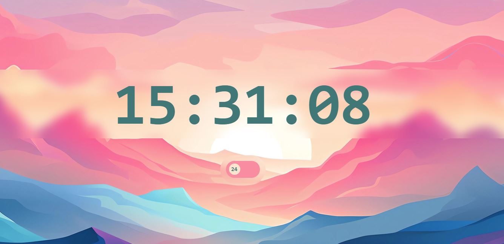

# 🕒 Digital Clock with 12/24 Hour Toggle

A sleek digital clock built using **HTML, CSS, and JavaScript**, featuring a stylish toggle to switch between **12-hour and 24-hour** time formats.

## 📸 Preview

> A minimalist clock centered on a visually appealing background with blur effects and a responsive toggle switch.

## 🚀 Features

- Live digital time that updates every second
- Toggle between **24-hour** and **12-hour (AM/PM)** formats
- Smooth transition and responsive design
- Built with vanilla HTML, CSS, and JS—no external libraries

## 🧪 Demo

Here’s how the digital clock looks in action:

### ⏲️ 24-Hour Mode

### 🕰️ 12-Hour Mode

## 🛠 How It Works

- The `Date()` object is used to fetch the current time every second.
- A checkbox toggles the `_24` flag to determine the display format.
- Time is displayed in either `HH:MM:SS` (24-hour) or `HH:MM:SS AM/PM` (12-hour) format based on user input.
- The toggle switch UI includes dynamic label transitions ("12" and "24") for an intuitive experience.

